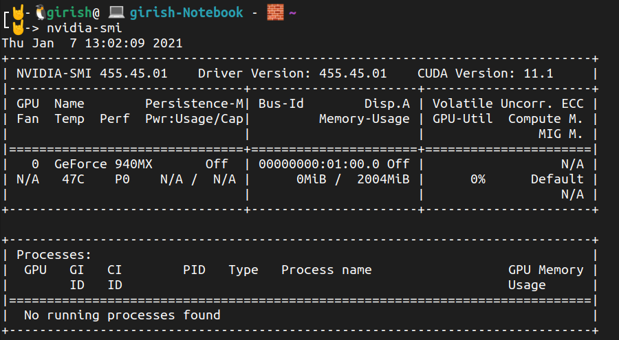

# Using Nvidia GPUs only for machine learning

## Problem with nvidia as the GPU

* I have Intel built in graphics as well as a dedicated nvidia graphics card in my laptop. Running the command `lspci | grep -e VGA -e 3D` confirms the same.

```Bash
🤘-> lspci | grep -e VGA -e 3D
00:02.0 VGA compatible controller: Intel Corporation Skylake GT2 [HD Graphics 520] (rev 07)
01:00.0 3D controller: NVIDIA Corporation GM108M [GeForce 940MX] (rev a2)
```

* I have set up my nvidia drivers and installed cuda and cudnn libraries for machine learning on ubuntu 20.10.

```bash
└🤘-> which nvidia-smi
/usr/bin/nvidia-smi

🤘-> nvcc --version
nvcc: NVIDIA (R) Cuda compiler driver
Copyright (c) 2005-2020 NVIDIA Corporation
Built on Wed_Jul_22_19:09:09_PDT_2020
Cuda compilation tools, release 11.0, V11.0.221
Build cuda_11.0_bu.TC445_37.28845127_0

└🤘-> apt list | grep libcudnn
libcudnn8-dev/unknown 8.0.5.39-1+cuda11.1 amd64
libcudnn8/unknown 8.0.5.39-1+cuda11.1 amd64 [upgradable from: 8.0.5.39-1+cuda11.0]
```

* So far I have been using `prime-select nvidia` or `prime-select on-demand` to enable nvidia graphics card. When I use `prime-select nvidia` and I ran `nvidia-smi` I saw a lot of processes using the nvidia GPU.

* Then I used `prime-select on-demand` so that only the XServer was running on the nvidia GPU. This makes the GPU RAM available for running ML workloads.

* But the problem I faced was, once the laptop wakes up from suspended state, I was not able to run anything on the GPU. When I ran the `tf.config.list_logical_devices(device_type="GPU")` I was getting **cuInit: CUDA_ERROR_UNKNOWN**. This [github issue](https://github.com/tensorflow/tensorflow/issues/5777) confirms the same.

* One of the solution proposed in the github issue was to run the following commands

```bash
sudo rmmod nvidia_uvm
sudo rmmod nvidia_drm
sudo rmmod nvidia_modeset
sudo rmmod nvidia
sudo modprobe nvidia
sudo modprobe nvidia_modeset
sudo modprobe nvidia_drm
sudo modprobe nvidia_uvm
```

* But when I run `sudo rmmod nvidia_drm` I was getting `module is in use`. This is because the **Xserver** process is running on the GPU. This can be confirmed by running the `nvidia-smi` command. But when I killed the Xserver process, laptop display went off.

* So I did `prime-select intel` thinking intel would be my primary GPU. But this made the nvidia GPU unusable. So I have to find a way to use nvidia GPU at the same time using intel GPU for XServer. That is when I found this [nvidia developer thread](https://forums.developer.nvidia.com/t/ubuntu-18-04-headless-390-intel-igpu-after-prime-select-intel-lost-contact-to-geforce-1050ti/66698)

## Solution- Part1

### Step-1

Run the following command `prime-select nvidia` Because the only intended function of `prime-select intel` is turning off the nvidia gpu for power-saving.

### Step-2

Add `nogpumanager` kernel parameter. This [page](https://wiki.ubuntu.com/Kernel/KernelBootParameters) contains information about how to set the kernel parameters permanently. Once the file is opened edit the line containing the configuration to look like `GRUB_CMDLINE_LINUX_DEFAULT="quiet splash nogpumanager"`. Save the file.

```Bash
sudo gedit /etc/default/grub
```

After editing the file, execute the following command `sudo update-grub`. This command should be executed without fail.

### Step-3

Run `ls -l /usr/share/X11/xorg.conf.d/` to find out various configuration files. XServer first loads all the `*.conf` files inside this directory.

> Files ending in `*.conf` in the `/usr/share/X11/xorg.conf.d` directory are automatically loaded by X at start prior to reading the `xorg.conf`. These files can each contain one or more Sections in the same format used by `xorg.conf`. - [X config](https://wiki.ubuntu.com/X/Config)

Create a file called `xorg.conf` inside `/etc/X11/`. Add the following contents to the file.

```conf
Section "Device"
    Identifier  "intel"
    Driver      "modesetting"
    BusID       "PCI:0:2:0"
EndSection

# You don't need to add this configuration if you find a file for 
# nvidia already in the folder /usr/share/X11/xorg.conf.d/
Section "OutputClass"
    Identifier    "nvidia"
    MatchDriver   "nvidia-drm"
    Driver        "nvidia"
    Option        "AllowEmptyInitialConfiguration"
    Option        "PrimaryGPU" "no"
    ModulePath    "/usr/lib/x86_64-linux-gnu/nvidia/xorg"
EndSection
```

I found the above configuration from [here](https://bbs.archlinux.org/viewtopic.php?pid=1826480#p1826480) and I found the `OutputClass` section for nvidia useful. But I didn't need to use it because I already found one for nvidia inside `/usr/share/X11/xorg.conf.d/`. So my final `/etc/X11/xorg.conf` looked like

```conf
Section "Device"
    Identifier  "intel"
    Driver      "modesetting"
    BusID       "PCI:0:2:0"
EndSection
```

`BusID` for the above configuration can be obtained by running the command `lspci | grep -e VGA -e 3D`. I got this info from [here](https://wiki.archlinux.org/index.php/xorg#Using_.conf_files) under the section **More than one graphics Card**.

### Step-4

Reboot the system.

Once I rebooted the system and I ran `nvidia-smi` and the output looks like below 

I was also execute the following commands and verify tensorflow was able to identify GPUs. But still the problem persists when the computer wakes up after being suspended.

```Python
import tensorflow as tf
tf.config.list_logical_devices(device_type="GPU")
```

## Solution-Part2

* `cuInit error` can be fixed if I am able to unload and reload all nvidia modules. For that I need to avoid getting `nvidia-* module in use` while trying to unload. The following steps will help me achieve this.

### Preferred way

* I found this extremely useful [github gist](https://gist.github.com/girip11/e63bcfe71c859fcbec7b360affdbc3ff)
* In addition to adding `nogpumanager`, I added the few more kernel parameters. Now the line looks like `GRUB_CMDLINE_LINUX_DEFAULT="nogpumanager i915.modeset=1 quiet splash nomodeset"`. Use the parameters in the same order as they are in this snippet. Then execute `sudo update-grub`.

* Disable the gpu-manager systemd service using the command `sudo systemctl mask gpu-manager.service`. The same can be verified using `sudo systemctl status gpu-manager.service`.

* `sudo apt install bbswitch-dkms` is not already installed.

* Add the following entries to `/etc/modules`

```conf
#/etc/modules contents
bbswitch
i915
```

* Add the below lines to `/etc/modprobe.d/blacklist.conf`. This is disable loading nouveau drivers in to the kernel at the startup. This can be confirmed by checking `lsmod | grep nouveau` after applying all the changes listed in this section and rebooting.

```conf
blacklist lbm-nouveau
alias nouveau off
alias lbm-nouveau off
options nouveau modeset=0
```

* Add the below lines to `/etc/modprobe.d/nvidia-blacklist.conf`. This will prevent the nvidia modules not loaded in to the kernel during startup. The same can be confirmed using `lsmod | grep nvidia`.

```conf
# Blacklist Nvidia
blacklist nvidia
blacklist mvidia-uvm
blacklist mvidia-drm
blacklist nvidia-modeset
```

* Add the line `options bbswitch load_state=1` to `/etc/modprobe.d/bbswitch`. This can be verified by checking `cat /proc/acpi/bbswitch` after reboot.

After making above changes to the directories `/etc/modules` and `/etc/modprobe.d` always execute `sudo update-initramfs -u -k all`. Once this command completes, reboot the system.

After reboot, to load and unload the nvidia modules, we can use those `modprobe` and `rmmod` command respectively.

**NOTE**: Nvidia DRM module is used for rendering only. But here we are trying to use nvidia for purely scientific computation purpose(machine learning) and use the intel graphics for rendering. So `lsmod | grep nvidia` should return results where `nvidia-drm` has count of 0. So that make it easier to unload and load nvidia modules once we hit the **cuda init Unknown error**.

### Hard way

* If the command `sudo rmmod nvidia_drm` fails with the message **module still in use**, execute the following command to verify it. `lsmod | grep nvidia`. It should display `count >= 1` for **nvidia-drm** module.

Follow the steps in this [stackexchange thread's accepted answer](https://unix.stackexchange.com/questions/440840/how-to-unload-kernel-module-nvidia-drm) to fix this issue. Press `Ctrl + Alt + F3` to open a text only terminal(its not a graphical terminal).

```Bash
sudo bash
# inside the root terminal type the below commands
systemctl isolate multi-user.target
lsmod | grep nvidia

modprobe -r nvidia-drm 
# or
rmmod nvidia_drm

# confirm if the module is unloaded with 
# count should be 0 against nvidia-drm
lsmod | grep nvidia

# start the display manager
systemctl start graphical.target
```

* But the drawback with this approach is all the windows/applications get closed. Use this as last resort.
