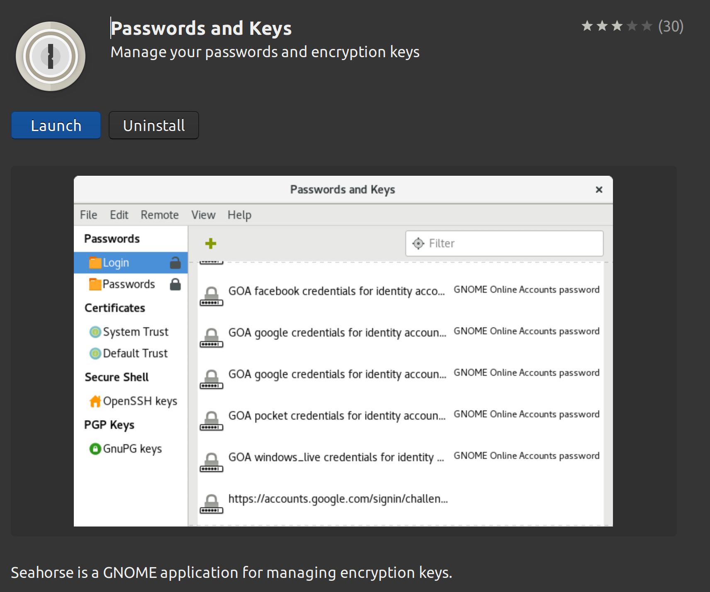

# Automate passphrase for SSH Keys

## Gnome keyring daemon

The [gnome-keyring-daemon](https://wiki.archlinux.org/title/GNOME/Keyring) is a service that stores your secrets, passwords, keys, certificates and make them available to applications. It is normally started automatically when a user logs into a desktop session.

In ubuntu 18.04 or later, gnome keyring daemon is automatically started by GNOME desktop environment and this service in turn launches **ssh-agent** by default. Post reboot we can verify the same by running the command `pgrep -af ssh-agent`. Gnome keyring daemon also sets the environment variable `SSH_AUTH_SOCK` after launching the `ssh-agent`. This environment variable will be used by keychain so that it reuses the already started **ssh-agent**.

```text
girish@girish-Notebook:~ $ pgrep -af ssh-agent
214325 /usr/bin/ssh-agent -D -a /run/user/1000/keyring/.ssh
```

**ssh-agent** launched by the gnome keyring daemon can access the secrets stored in the keyring.

**NOTE**:

If you are using GNOME, Unity, Cinnamon, or MATE, you are done. The initialisation is completed and environment variables are set automatically.

If you **ARE NOT** using GNOME, Unity, Mate, or Cinnamon as your desktop environment, initialisation will not complete automatically.

Add the following to your `~/.profile` or `~/.bashrc`

```bash
if [ -n "$DESKTOP_SESSION" ];then
  eval $(gnome-keyring-daemon --start --components=pkcs11,secrets,ssh,gpg)
  export SSH_AUTH_SOCK
  export GPG_AGENT_INFO
fi
```

## SSH configuration

Add the below section to SSH config file at `$HOME/.ssh/config` if not already present.

```conf
Host *
    AddKeysToAgent yes
```

## Add secrets to GNOME keyring daemon using seahorse

- Install seahorse from ubuntu software center.



- We can add the SSH keys to the OpenSSH keys using Seahorse GUI.
- Alternatively, to permanently save the a passphrase in the keyring, use `ssh-askpass` from the seahorse package:

```bash
/usr/lib/seahorse/ssh-askpass <path_to_my_key>
```

## Install and setup keychain

> - Keychain helps you to manage SSH and GPG keys in a convenient and secure manner. It acts as a frontend to ssh-agent and ssh-add, but allows you to easily have one long running ssh-agent process per system, rather than the norm of one ssh-agent per login session.
> - This dramatically reduces the number of times you need to enter your passphrase. With keychain, you only need to enter a passphrase once every time your local machine is rebooted. Keychain also makes it easy for remote cron jobs to securely "hook in" to a long-running ssh-agent process, allowing your scripts to take advantage of key-based logins. -[Keychain](https://www.funtoo.org/Keychain)

- Install [keychain](https://www.funtoo.org/Keychain).

- To enable keychain, add the following line to .bashrc.

```bash
key_files=('~/.ssh/id_rsa1' '~/.ssh/id_rsa2')
# This will inherit the ssh-agent started by the gnome keyring and hence
# we don't need to enter passphrases after every reboot.
/usr/bin/keychain --agents ssh --inherit any --eval ${key_files[*]}
source "$HOME/.keychain/$HOSTNAME-sh"
```

---

## References

- [Enter SSH passphrase once](https://askubuntu.com/a/1383735/1555951)
- [Keychain github](https://github.com/funtoo/keychain)
